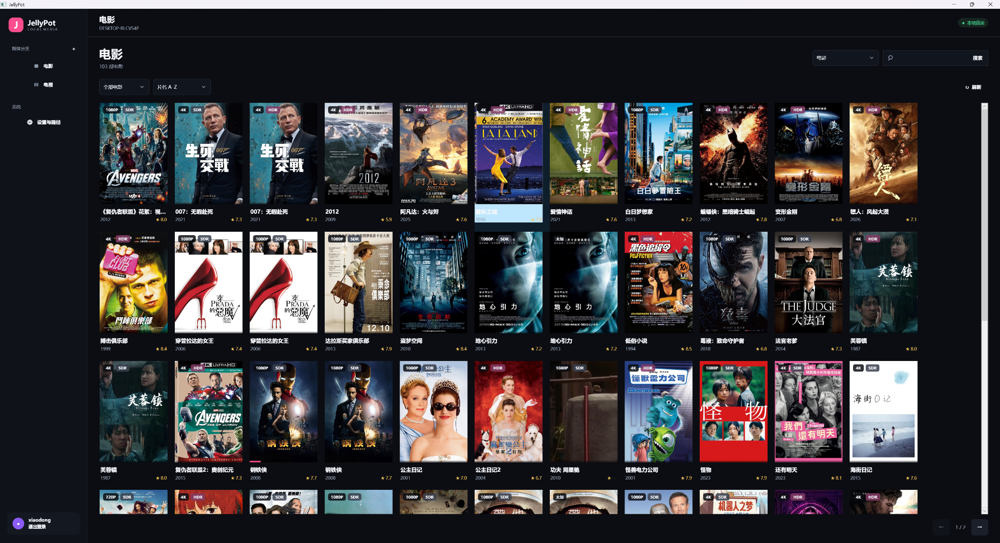
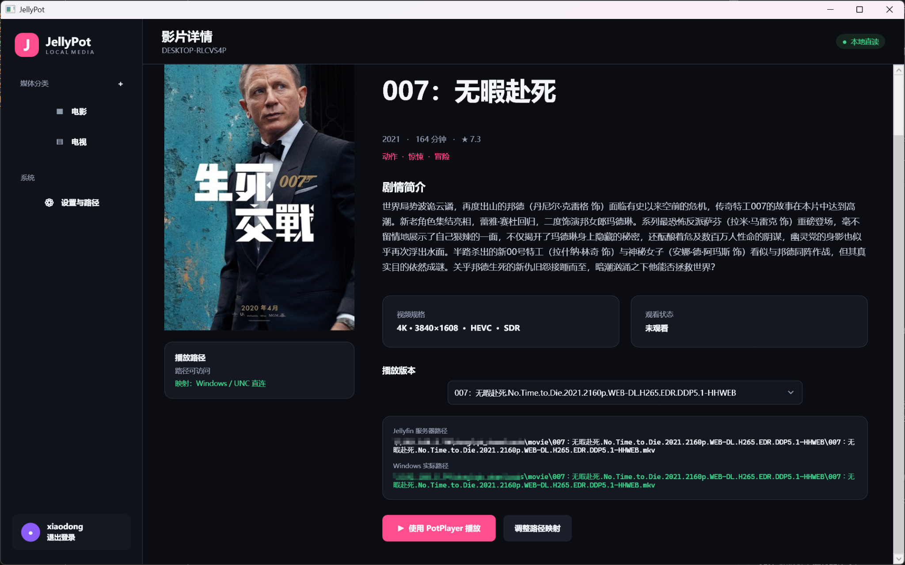

# JellyPot

<p align="center">
  <strong>用 Jellyfin 管理媒体库，用 PotPlayer 直接播放本地或 NAS 原始文件。</strong>
</p>

JellyPot 是一个面向 Windows 11 的本地媒体客户端。它读取 Jellyfin Server 中的媒体库、海报和影片信息，并在用户点击播放时，将实际文件路径直接交给 PotPlayer。

与通过浏览器或普通流媒体客户端播放不同，JellyPot 的目标是让 Jellyfin 专注于媒体整理，让 PotPlayer 继续负责视频渲染、HDR、字幕、音轨和音频输出。影片可通过本地磁盘、映射盘符或 SMB/UNC 网络路径直接读取，不经过 JellyPot 转码。

> JellyPot 不是 Jellyfin Server 的替代品。使用前仍需要一个可正常工作的 Jellyfin Server。

## 界面预览

### 海报墙与媒体信息标志



### 影片详情与 PotPlayer 本地播放



## 已实现功能

### 媒体库浏览

- 连接 Jellyfin Server 并读取电影、电视剧等媒体库。
- 以海报墙方式展示影片。
- 显示中文片名、年份、评分等基本信息。
- 支持影片搜索、媒体库筛选和排序。
- 支持分页浏览和手动刷新媒体库。

### 画质与格式标志

JellyPot 会根据 Jellyfin 返回的媒体信息，在海报上直接显示常用规格标志，例如：

- `4K`
- `1080P`
- `720P`
- `HDR`
- `SDR`

无需进入详情页，即可快速判断影片的大致画质规格。

### 影片详情页

详情页可展示：

- 海报、片名、年份和片长
- 评分、类型和剧情简介
- 分辨率、视频编码、HDR/SDR 信息
- 已观看或未观看状态
- Jellyfin Server 中记录的媒体文件路径
- 路径映射后的 Windows 实际访问路径
- 同一影片的不同播放版本

### PotPlayer 一键播放

点击 **“使用 PotPlayer 播放”** 后，JellyPot 会：

1. 获取当前影片对应的真实媒体文件路径；
2. 根据路径映射规则转换为 Windows 可访问路径；
3. 检查文件或网络共享是否可以访问；
4. 调用本机 PotPlayer 打开该文件。

实际播放链路为：

```text
本地硬盘 / NAS SMB 共享
        ↓
Windows 文件路径或 UNC 路径
        ↓
PotPlayer 直接打开原始媒体文件
```

JellyPot 不对视频重新编码，也不负责转码播放。最终画面、HDR、字幕、音轨、滤镜和音频输出效果由 PotPlayer 的配置决定。

### 路径映射

Jellyfin Server 看到的文件路径，可能与 Windows 客户端实际能够访问的路径不同。JellyPot 支持配置多条路径映射规则。

例如，Jellyfin Server 运行在 NAS Docker 中：

```text
服务器路径：/media/movies/007/movie.mkv
```

Windows 通过 SMB 访问时：

```text
Windows 路径：\\192.168.1.74\Movies\007\movie.mkv
```

可以设置：

```text
/media/movies/
→
\\192.168.1.74\Movies\
```

当 Jellyfin Server 返回的路径本身已经是 Windows 可访问的本地路径、映射盘符或 UNC 路径时，可以直接播放，也可以不配置额外转换规则。

## 运行要求

- Windows 10 或 Windows 11，推荐 Windows 11 x64
- 一个已部署并可正常访问的 Jellyfin Server
- PotPlayer 64 位版本
- Windows 能够访问媒体文件所在的本地磁盘或 NAS 共享目录
- 使用 NAS 时，建议采用稳定的有线局域网连接

## 安装

### 方法一：使用 Release 版本

1. 打开本仓库的 **Releases** 页面。
2. 下载最新的 Windows 版本压缩包。
3. 解压到固定目录，例如：

```text
D:\Apps\JellyPot
```

4. 运行 `JellyPot.exe`。

> 请不要只把 EXE 单独复制出来。程序目录中的其他文件可能是正常运行所必需的。

### 方法二：从源码运行

开发环境需要安装：

- .NET SDK 8.0
- Visual Studio 2022 或 VS Code
- VS Code 的 C# Dev Kit 扩展

在仓库根目录运行：

```powershell
dotnet restore
dotnet build
dotnet run --project .\src\JellyPot.App\JellyPot.App.csproj
```

## 首次使用

首次启动后，进入左侧的 **“设置与路径”** 页面，依次完成以下配置。

### 1. 配置 Jellyfin Server

填写 Jellyfin Server 地址，例如：

```text
http://192.168.1.20:8096
```

如果 Jellyfin Server 就安装在当前电脑，也可以使用：

```text
http://127.0.0.1:8096
```

随后填写 Jellyfin 用户名和密码并测试连接。

### 2. 选择 PotPlayer

选择 PotPlayer 64 位可执行文件。常见安装路径为：

```text
C:\Program Files\DAUM\PotPlayer\PotPlayerMini64.exe
```

实际路径以你的安装位置为准。建议使用设置页中的文件选择按钮，而不是手工输入。

### 3. 配置媒体路径

JellyPot 支持三种常见播放路径：

```text
D:\Movies\Movie.mkv
```

```text
Z:\Movies\Movie.mkv
```

```text
\\NAS名称\Movies\Movie.mkv
```

其中 UNC 路径通常比映射盘符更加稳定，因为它不依赖特定 Windows 用户会话中的盘符连接状态。

### 4. 添加路径映射

仅当 Jellyfin 返回路径与 Windows 实际访问路径不一致时，才需要添加映射。

示例一：Docker 路径映射到 NAS 共享

```text
Jellyfin 路径前缀：/media/movies/
Windows 路径前缀：\\192.168.1.74\Movies\
```

示例二：服务器本地盘符映射到客户端 NAS 路径

```text
Jellyfin 路径前缀：D:\Movies\
Windows 路径前缀：\\NAS\Movies\
```

配置完成后，使用路径测试功能确认目标目录和影片文件可以访问。

## 使用方法

### 浏览影片

1. 在左侧选择 **电影** 或 **电视**。
2. 通过顶部筛选框选择媒体库或分类。
3. 使用排序菜单按片名等条件排列。
4. 在搜索框输入片名查找资源。
5. 点击刷新按钮重新读取媒体库信息。

### 查看影片信息

点击海报进入详情页。详情页会显示剧情、评分、画质规格、观看状态以及实际播放路径。

同一电影存在多个文件版本时，可以先在 **“播放版本”** 中选择需要播放的版本。

### 使用 PotPlayer 播放

确认详情页显示：

```text
路径可访问
```

并且 Windows 实际路径正确后，点击：

```text
使用 PotPlayer 播放
```

JellyPot 会启动 PotPlayer，并直接打开对应文件。

## 为什么使用 PotPlayer 直接播放

Jellyfin 的 Direct Play 本身也可以避免视频重新编码，但 JellyPot 选择调用 PotPlayer，主要是为了保留 Windows 本地播放器的完整能力和个人配置，例如：

- PotPlayer 已有的视频渲染和硬件解码设置
- HDR 输出或色调映射设置
- 字幕字体、位置和渲染方式
- TrueHD、DTS-HD MA 等音轨的解码或直通设置
- 声卡、DAC、蓝牙解码耳放等音频设备配置
- LAV Filters、madVR 或其他自定义滤镜链
- 快捷键、倍速、画面比例和播放习惯

因此，JellyPot 的核心定位不是“替代 PotPlayer”，而是给 PotPlayer 增加一个由 Jellyfin 驱动的海报墙和媒体管理入口。

## 路径映射建议

### 推荐使用 UNC 路径

```text
\\192.168.1.74\Movies\
```

优点：

- 不依赖映射盘符是否自动重连；
- 多个 Windows 用户之间更容易保持一致；
- 更容易判断 NAS 的真实访问位置。

### NAS 凭据

第一次访问受保护的 NAS 共享时，Windows 可能要求输入用户名和密码。可以先在文件资源管理器中打开：

```text
\\NAS的IP地址\共享名称
```

完成登录并确认能够手动打开影片后，再在 JellyPot 中测试路径。

### 路径映射原则

- 路径前缀应尽量填写到稳定的媒体根目录。
- 不要把单部电影的完整文件名写成通用映射规则。
- 多条规则存在重叠时，应优先匹配更具体的路径。
- 修改 NAS 共享名称或 Docker 挂载目录后，需要同步更新 JellyPot 的映射。

## 常见问题

### 点击播放后提示路径不可访问

依次检查：

1. 把详情页显示的 Windows 实际路径复制到文件资源管理器；
2. 确认该文件可以手动打开；
3. 检查 NAS 是否在线；
4. 检查共享名称、用户名和密码；
5. 检查 Jellyfin 路径前缀是否与映射规则完全对应；
6. 检查路径中的斜杠方向和结尾分隔符。

### PotPlayer 没有启动

- 检查 PotPlayer EXE 路径是否正确；
- 建议选择 `PotPlayerMini64.exe`；
- 在设置页重新选择 PotPlayer；
- 确认安全软件没有阻止 JellyPot 启动外部程序。

### 可以看到海报，但无法播放

海报和简介来自 Jellyfin API，能够显示海报只代表 Jellyfin Server 连接正常，不代表 Windows 一定能访问原始媒体文件。还需要单独确认本地路径、映射盘符或 NAS UNC 路径可以访问。

### Jellyfin Server 返回 Linux 路径

这是 NAS Docker 部署中的正常情况。为该媒体根目录添加一条 Linux 路径到 Windows UNC 路径的映射即可。

### 4K 或 HDR 标志不正确

JellyPot 的标志依赖 Jellyfin Server 已扫描到的媒体信息。可以先在 Jellyfin 控制台中重新扫描媒体库或刷新影片元数据，再回到 JellyPot 刷新。

### 播放时会经过 Jellyfin 转码吗

不会。点击 PotPlayer 播放后，PotPlayer 直接读取 Windows 路径指向的原始文件，Jellyfin Server 只提供媒体资料和文件路径。

## 数据与安全

- 不建议把 Jellyfin 密码、访问令牌或 NAS 密码提交到 GitHub。
- 发布日志或截图前，请遮挡服务器 IP、共享路径、用户名和令牌。
- 不要把配置文件中的私人服务器信息打包进公开 Release。
- 不建议将未配置 HTTPS 的 Jellyfin 管理端口直接暴露到公网。

## 项目定位

JellyPot 适合以下场景：

- 电影存放在 Windows 硬盘或 NAS 中；
- 希望通过海报墙整理和搜索影片；
- 已经习惯 PotPlayer 的画面、HDR、字幕和音频设置；
- 希望播放时直接读取原始文件；
- 不希望为了海报管理而放弃本地播放器。

它不适合完全依赖互联网串流、无法直接访问原始媒体路径，或需要服务器实时转码适配多种外部设备的场景。

## 免责声明

JellyPot 是独立项目，与 Jellyfin 项目及 PotPlayer 官方没有隶属或授权关系。Jellyfin、PotPlayer 及相关名称和商标归各自权利人所有。

使用本软件时，请确保你拥有所访问媒体文件的合法使用权。

## 致谢

- Jellyfin：提供媒体库、元数据和开放接口
- PotPlayer：负责 Windows 本地媒体播放
- .NET 与 WPF：用于构建 Windows 桌面客户端
